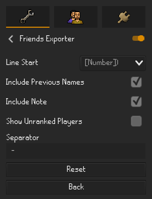
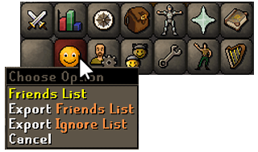
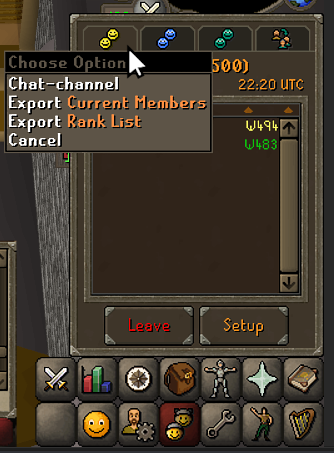
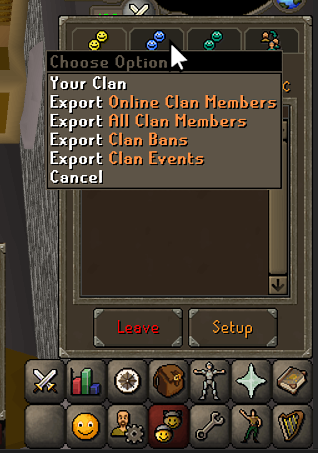
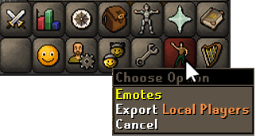

# Friends Exporter
This plugin adds an export option to several different lists 
of players and interfaces, including those related to friends, 
ignores, chat-channel, clan, and local players. 

The lists are exported to files located in your RuneLite directory 
under the `player-exports` folder 
(typically `%USERPROFILE%/.runelite/player-exports`).

- Line Start controls how you would like the beginning of each line to look, 
- either with nothing or with a number and various options of punctuation.

## Friends/Ignore

Via a right-click option to the Friends tab. Both options work nearly identically.
The **Include Previous Name** option in the configuration controls whether a user's
previous name is recorded in their exported entry. The **Include Note** option controls 
whether to include any notes added by the 
[Friend Notes](https://github.com/runelite/runelite/wiki/Friend-Notes) default plugin.

- **Export Friends List**
  - Exports the player's friends list. 
- **Export Ignore List**
  - Exports the player's ignore list.

## Chat-Channel
This plugin currently supports two lists relating to the 
chat-channel (previously known as **Friends Chat**).
These features are accessible by right-clicking the 
**Chat-channel** tab in the **Chat-channel/Clan/Guest Clan/Grouping** tab.

- **Export Current Members**
  - A list of all online members currently in the 
    chat-channel the player has joined.
- **Export Rank List**
  - A list of members in a player's personal chat-channel. 
  - Requires the **Chat-channel Setup** menu to be open.
  - The **Show Unranked Players** option in the configuration 
    controls whether unranked members appear in this export.

## Clan

This plugin currently supports four different list options 
relating to clans, accessible via a right-click on the **Clan** 
tab in the **Chat-channel/Clan/Guest Clan/Grouping** tab.

- **Export Online Clan Members**
  - Exports the list of online clan members.
- **Export All Clan Members**
  - Exports the list of all clan members. 
  - Requires the **Clan Settings** menu to be open to the **Members** interface.
- **Export Clan Bans**
  - Exports the list of banned members in the player's clan. 
  - Requires the **Clan Settings** menu to be open to the **Bans** interface.
- **Export Clan Events**
  - Exports the list of clan events containing the various information related to them.
  - Requires the **Clan Settings** menu to be open to the **Events** interface.

## Local Players

This plugin allows you to export a list of loaded players in the vicinity, 
accessible via a right-click on the **Emotes** tab.

- **Export Local Players**
  - Exports all loaded players surrounding the player.
